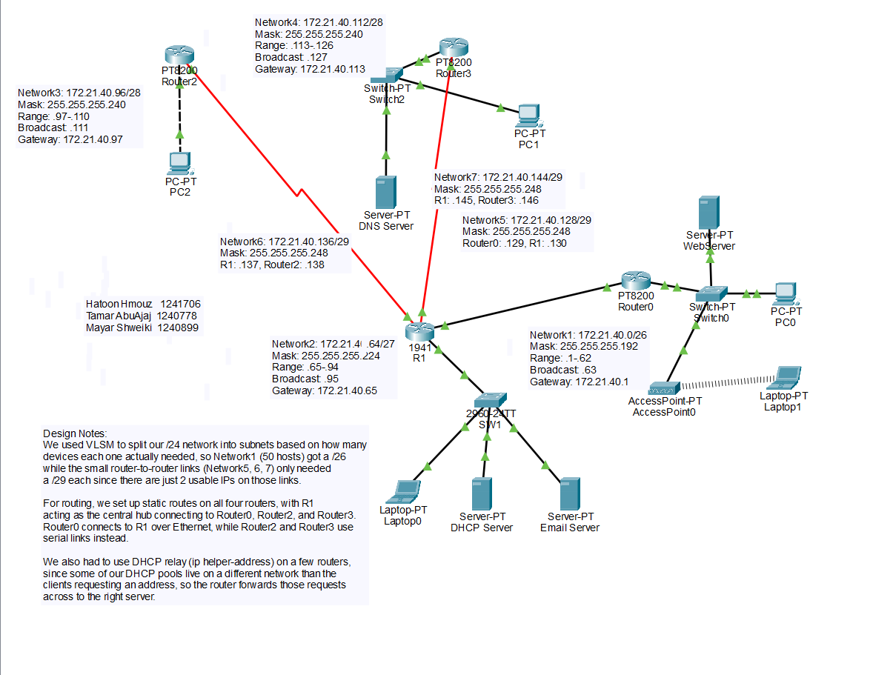
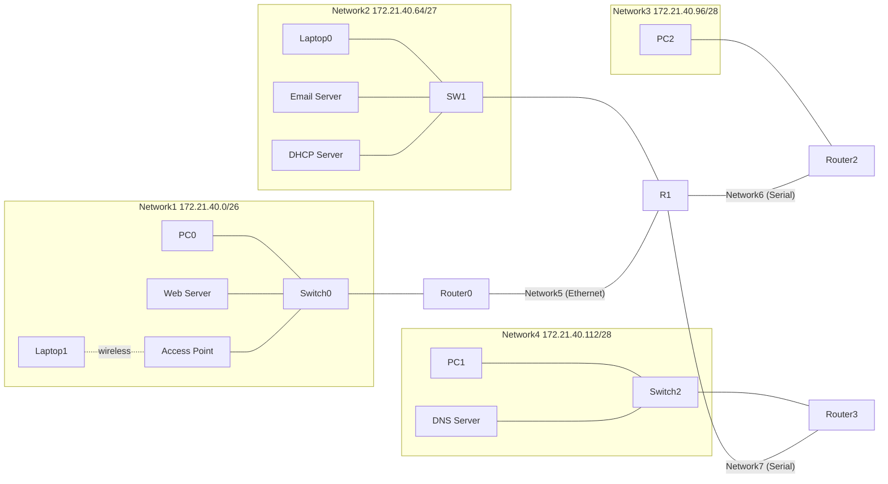
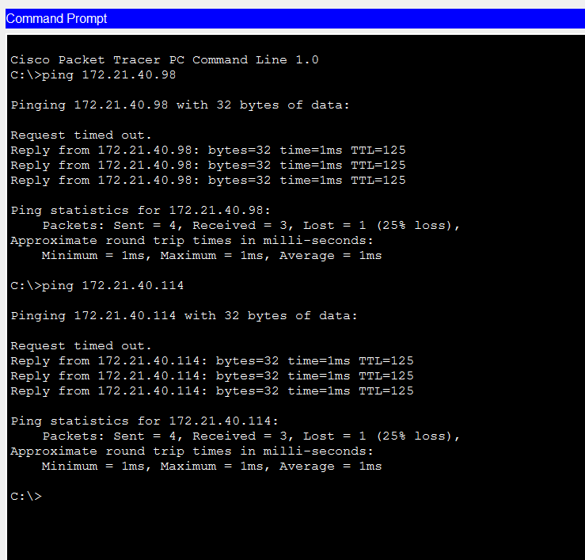
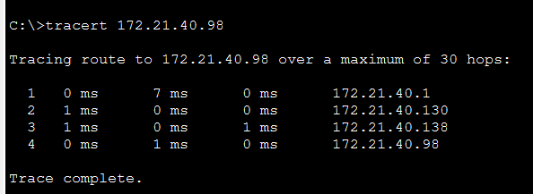
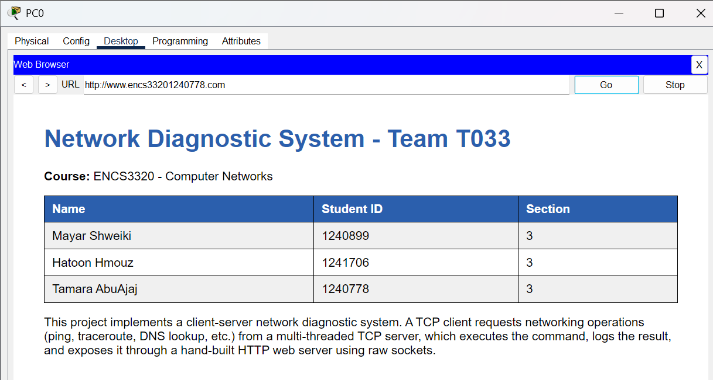
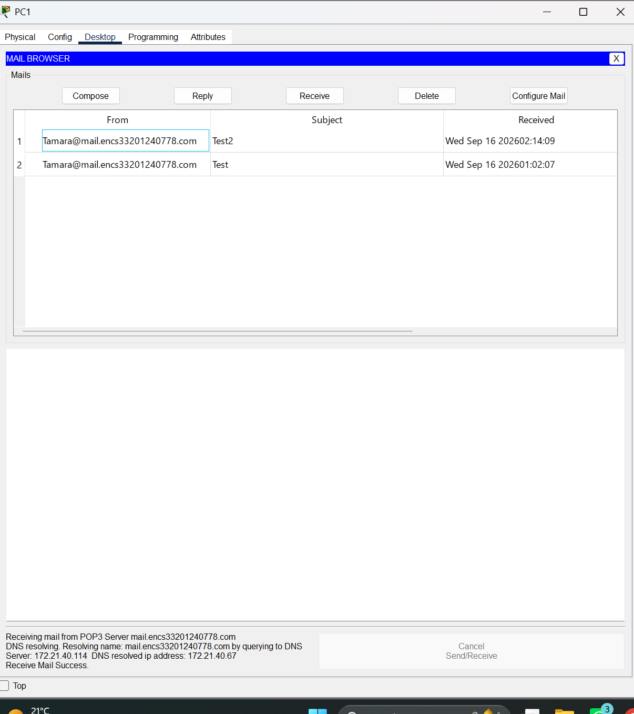

# Enterprise Network Design: VLSM, Static Routing and Network Services


A four-router network designed and implemented in **Cisco Packet Tracer**. It combines VLSM subnetting, static routing, DHCP (on routers and on a server, with DHCP relay), DNS, HTTP, email, and a WPA-PSK secured wireless network.

Built as a group project for **ENCS3320: Computer Networks** at Birzeit University.

---

## Table of Contents

1. [Overview](#overview)
2. [Network Topology](#network-topology)
3. [IP Addressing and VLSM Design](#ip-addressing-and-vlsm-design)
4. [Device Configuration](#device-configuration)
5. [Static Routing](#static-routing)
6. [Network Services](#network-services)
7. [Testing and Verification](#testing-and-verification)
8. [How to Run](#how-to-run)
9. [Repository Structure](#repository-structure)
10. [What We Learned](#what-we-learned)
11. [Team](#team)

---

## Overview

| Item | Details |
|---|---|
| **Course** | ENCS3320: Computer Networks, Birzeit University |
| **Tool** | Cisco Packet Tracer 9.0 |
| **Base network** | `172.21.40.0/24` |
| **Devices** | 4 routers, 3 switches, 4 servers, 5 end devices, 1 access point |
| **Routing** | Static routes on all four routers, with R1 as the central hub |
| **Services** | DHCP, DNS, HTTP, Email |
| **Wireless** | WPA-PSK secured SSID for Laptop1 |

### Objectives

- Design a VLSM scheme for seven networks from a single `/24` block
- Configure routers, switches, servers and end devices
- Implement static routing so that every network can reach every other network
- Provide dynamic addressing with DHCP, including relay across routers
- Configure DNS, web and email services
- Verify connectivity and trace paths with `ping` and `tracert`

---

## Network Topology





R1 is the hub. Router0 connects to it over Ethernet, and Router2 and Router3 connect over serial links.

---

## IP Addressing and VLSM Design

The `/24` block was divided with **Variable Length Subnet Masking (VLSM)**. Subnets are allocated from largest to smallest to avoid wasted space and overlap.

### Subnet sizing

| Network | Required IPs | Prefix | Subnet Mask | Usable Hosts |
|---|---|---|---|---|
| Network1 | 50 | /26 | 255.255.255.192 | 62 |
| Network2 | 28 | /27 | 255.255.255.224 | 30 |
| Network3 | 14 | /28 | 255.255.255.240 | 14 |
| Network4 | 10 | /28 | 255.255.255.240 | 14 |
| Network5 | 4 | /29 | 255.255.255.248 | 6 |
| Network6 | 4 | /29 | 255.255.255.248 | 6 |
| Network7 | 4 | /29 | 255.255.255.248 | 6 |

### Subnet allocation

| Network | Network Address | Usable Range | Broadcast | Default Gateway |
|---|---|---|---|---|
| Network1 | 172.21.40.0/26 | .1 to .62 | .63 | 172.21.40.1 (Router0) |
| Network2 | 172.21.40.64/27 | .65 to .94 | .95 | 172.21.40.65 (R1) |
| Network3 | 172.21.40.96/28 | .97 to .110 | .111 | 172.21.40.97 (Router2) |
| Network4 | 172.21.40.112/28 | .113 to .126 | .127 | 172.21.40.113 (Router3) |
| Network5 | 172.21.40.128/29 | .129 to .134 | .135 | Router0 to R1 link |
| Network6 | 172.21.40.136/29 | .137 to .142 | .143 | R1 to Router2 link |
| Network7 | 172.21.40.144/29 | .145 to .150 | .151 | R1 to Router3 link |

Unused space `172.21.40.152` to `172.21.40.255` is left free for future growth.

### Device IP assignments

| Device | Interface | IP Address | Mask | Assignment |
|---|---|---|---|---|
| Router0 | Gi0/0/0 (Network1) | 172.21.40.1 | /26 | Static |
| Router0 | Gi0/0/1 (Network5) | 172.21.40.129 | /29 | Static |
| R1 | Gi0/0 (Network2) | 172.21.40.65 | /27 | Static |
| R1 | Gi0/1 (Network5) | 172.21.40.130 | /29 | Static |
| R1 | Se0/0/1 (Network6) | 172.21.40.137 | /29 | Static |
| R1 | Se0/1/0 (Network7) | 172.21.40.145 | /29 | Static |
| Router2 | Gi0/0/0 (Network3) | 172.21.40.97 | /28 | Static |
| Router2 | Se0/1/0 (Network6) | 172.21.40.138 | /29 | Static |
| Router3 | Gi0/0/0 (Network4) | 172.21.40.113 | /28 | Static |
| Router3 | Se0/1/0 (Network7) | 172.21.40.146 | /29 | Static |
| Web Server | Network1 | 172.21.40.2 | /26 | Static |
| Laptop1 (wireless) | Network1 | 172.21.40.3 | /26 | Static |
| PC0 | Network1 | 172.21.40.5 to .62 | /26 | DHCP (Pool2) |
| DHCP Server | Network2 | 172.21.40.66 | /27 | Static |
| Email Server | Network2 | 172.21.40.67 | /27 | Static |
| Laptop0 | Network2 | from 172.21.40.69 | /27 | DHCP (Pool0) |
| PC2 | Network3 | 172.21.40.98 | /28 | Static |
| DNS Server | Network4 | 172.21.40.114 | /28 | Static |
| PC1 | Network4 | from 172.21.40.117 | /28 | DHCP (Pool1) |

---

## Device Configuration

### Routers
- Hostnames: `Router0`, `R1`, `Router2` (hostname `R2`) and `Router3` (hostname `R3`)
- Interface addresses set and activated for every link in use
- Static routes on every router (see below)

### DHCP

| Pool | Hosted On | Serves | Gateway | DNS | Excluded Addresses |
|---|---|---|---|---|---|
| `Pool0_<stdID>` | R1 | Network2 | 172.21.40.65 | 172.21.40.114 | .65 to .68 |
| `Pool1_<stdID>` | R1 | Network4 | 172.21.40.113 | 172.21.40.114 | .113 to .116 |
| `Pool2_<stdID>` | DHCP Server | Network1 | 172.21.40.1 | 172.21.40.114 | .1 to .4 (pool starts at .5) |

The first four usable addresses of each network are reserved for static devices such as gateways and servers.

**DHCP relay (`ip helper-address`):** some pools live on a different network from the clients that need them, so the gateway forwards the broadcast requests:

| Router | Interface | Helper Address | Purpose |
|---|---|---|---|
| Router0 | Gi0/0/0 | 172.21.40.66 | PC0 reaches the DHCP Server (Pool2) |
| Router3 | Gi0/0/0 | 172.21.40.65 | PC1 reaches R1 (Pool1) |

### Wireless access point
- SSID: `ENCS3320_<stdID>`
- Security: **WPA-PSK**
- Laptop1 has its Ethernet module replaced with a wireless module and connects to the SSID with a static address

---

## Static Routing

Every router has a route to each network that is not directly connected.

| Router | Destination | Next Hop |
|---|---|---|
| Router0 | 172.21.40.64/27 (Network2) | 172.21.40.130 |
| Router0 | 172.21.40.96/28 (Network3) | 172.21.40.130 |
| Router0 | 172.21.40.112/28 (Network4) | 172.21.40.130 |
| Router0 | 172.21.40.136/29 (Network6) | 172.21.40.130 |
| Router0 | 172.21.40.144/29 (Network7) | 172.21.40.130 |
| R1 | 172.21.40.0/26 (Network1) | 172.21.40.129 |
| R1 | 172.21.40.96/28 (Network3) | 172.21.40.138 |
| R1 | 172.21.40.112/28 (Network4) | 172.21.40.146 |
| Router2 | Networks 1, 2, 4, 5, 7 | 172.21.40.137 |
| Router3 | Networks 1, 2, 3, 5, 6 | 172.21.40.145 |

Example:

```
R1(config)# ip route 172.21.40.96 255.255.255.240 172.21.40.138
```

---

## Network Services

| Service | Host | Configuration |
|---|---|---|
| **DHCP** | DHCP Server and R1 | Three pools as described above |
| **DNS** | DNS Server | A records for `www.encs3320<stdID>.com`, `mail.encs3320<stdID>.com`, `pc2` and `laptop1` |
| **HTTP** | Web Server | Domain `www.encs3320<stdID>.com` with a custom page (team and project info) |
| **Email** | Email Server | Domain `mail.encs3320<stdID>.com` with two user accounts for PC0 and PC1 |

DNS records:

| Name | Type | Address |
|---|---|---|
| `www.encs3320<stdID>.com` | A | 172.21.40.2 |
| `mail.encs3320<stdID>.com` | A | 172.21.40.67 |
| `pc2` | A | 172.21.40.98 |
| `laptop1` | A | 172.21.40.3 |

---

## Testing and Verification

| Test | Method | Result |
|---|---|---|
| Connectivity between all networks | `ping` | `[PASS]` |
| DHCP address assignment | `ipconfig` on PC0, Laptop0, PC1 | `[PASS]` |
| DNS name resolution | `nslookup` and browser | `[PASS]` |
| Web access | Browser to `www.encs3320<stdID>.com` | `[PASS]` |
| Email send and receive | Email client on PC0 and PC1 | `[PASS]` |
| Path verification | `tracert` between end devices | `[PASS]` |
| Wireless connectivity | Laptop1 associated with the SSID | `[PASS]` |

Screenshots:

```markdown




```

---

## How to Run

1. Install [Cisco Packet Tracer](https://www.netacad.com/courses/packet-tracer) (free with a Cisco Networking Academy account).
2. Clone this repository:
   ```bash
   git clone https://github.com/htoonhmouz123/Network-Design-Packet-Tracer.git
   ```
3. Open `network-design.pkt` in Packet Tracer 9.0 or later.
4. Click any device to inspect its configuration, or use the **Simulation** tab to watch packets move through the network.

---

## Repository Structure

```
Network-Design-Packet-Tracer/
├── README.md
├── network-design.pkt        # Packet Tracer project file
└── images/
    ├── topology.png
    ├── ping-test.png
    ├── tracert.png
    ├── web-page.png
    └── email.png
```

---

## What We Learned

- Designing efficient VLSM schemes and calculating network, broadcast and host ranges
- Building static routing across a hub-and-spoke router layout
- Configuring DHCP on routers and servers, and using DHCP relay between subnets
- Setting up DNS, HTTP and email services and testing them end to end
- Securing a wireless network with WPA-PSK
- Documenting a network clearly and working as a team

---

## Team

| Name | GitHub |
|---|---|
| Hatoon Hmouz | [@htoonhmouz123](https://github.com/htoonhmouz123) |
| Tamara AbuAjaj | `[link]` |
| Mayar Shweiki | `[link]` |
